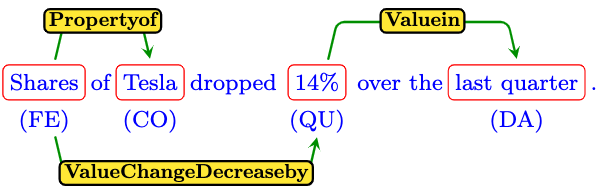

[](https://zenodo.org/badge/latestdoi/643674148)

# FIRE Dataset

The FIRE Dataset is a dataset of named entities and relations in the financial domain. Our paper "FIRE: A Dataset for FInancial Relation Extraction" is available at [arXiv](https://arxiv.org/abs/XXXX.XXXX).

## Description

FIRE features 13 types of entities and 18 types of relations and can be used to train and evaluate machine learning models in the task of financial joint named entity recognition and relation extraction.

Here is an example instance from the dataset and how it is represented in json format:
<p align="center">
  
</p>

```json
{
    "tokens": ["Shares","of","Tesla","dropped","14%","over","the","last","quarter"],
    "entities": [
        {"type": "FinancialEntity", "start": 0, "end": 1},
        {"type": "Company", "start": 2, "end": 3},
        {"type": "Quantity", "start": 4, "end": 5},
        {"type": "Date", "start": 7, "end": 9},
    ],
    "relations": [
        {"type": "propertyof", "head": 0, "tail": 1},
        {"type": "ValueChangeDecreaseby", "head": 0, "tail": 2},
        {"type": "Valuein", "head": 2, "tail": 3},
    ],
    "duration": 42,
}
```
Similar to the above example, each instance in the dataset contains four fields as follows:
- tokens: The raw text of the sentence represented as a list of tokens.
- entities: A list of named entities in the sentence. Each named entity is represented by a dictionary with keys: type (indicating the entity type), start and end, indicating the start(inclusive) and end(exclusive) token positions of the entity in the sentence.
- relations: A list of relations in the sentence. Each relation is represented by a dictionary with keys: type (indicating the relation type), head and tail (indicating the entity indices involved in the relation)
- duration: The time, in seconds, it took the human annotator to finish labeling this instance.
## Dataset Statistics

| Split  | # of Instances | # of Entity Mentions | # of Relation Mentions |
| ------ | -------------- | -------------------- | ---------------------- |
| Train  | 2,117          | 10,789               | 5,928                  |
| Dev    | 454            | 2,294                | 1,225                  |
| Test   | 454            | 2,251                | 1,213                  |

## Setup Instructions

To set up your Python environment to run the baselines, follow these steps:

1. Clone the repository:
```bash
git clone https://github.com/IshitaSatija/text-mining
cd FIRE
```
2. Install the required packages for the model you want to run:
  - For SPERT:
  ```bash
  pip install -r spert_requirements.txt
  ```
```bash
python main.py --mode train --model spert
```

Each model has a configuration file under the 'configs' directory. You can set gpu_id, adjust hyper-parameters or change training configuration to run a different experiment. To reproduce the results in the paper using the FinBERT model, replace the `model_path` and `tokenizer_path` fields with `ProsusAI/finbert` in the SpERT configuration file. 
## Citation
1. 

```bibtex
@article{Hassan2023fire,
  title={FIRE: A Dataset for FInancial Relation Extraction},
  author={Hassan Hamad, Abhinav Thakur, Sujith Pulikodan, Nijil Kolleri and Keith M. Chugg},
  booktitle = "Findings of the Association for Computational Linguistics: NAACL 2024",
  year={2024}
}
```
